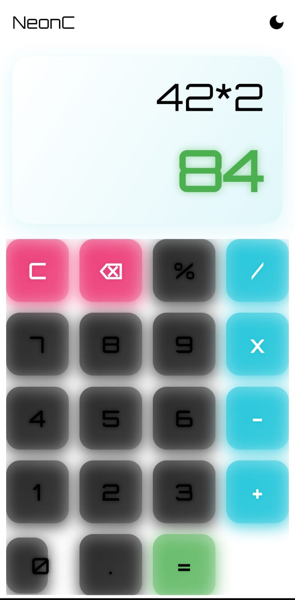
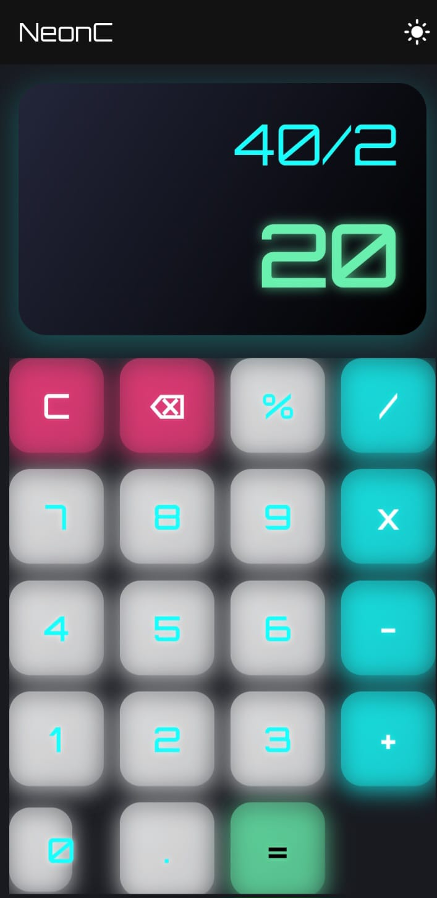

# NeonC Calculator

A sleek, offline, cross-platform calculator app inspired by neon design. Built with Flutter for Android and iOS.

## ✨ Features
- Neon-themed, modern UI
- Light & dark mode toggle
- Responsive and smooth on all screen sizes
- Basic arithmetic operations (+, -, ×, ÷, %, decimal)
- Clear and backspace functions
- 100% offline, no internet required

## 📱 Screenshots
<<<<<<< HEAD
<!-- Add screenshots here if available -->

=======

>>>>>>> e75cffb (updated README.md)
## 🚀 Getting Started (Developers) and Installation
1. Clone this repo
2. Run `flutter pub get`
3. Run `flutter run` to launch the app
4. Run `flutter build apk --release` to build the app
<<<<<<< HEAD
5. The app will be found at `-build/app/outputs/flutter-apk/app-release.apk`

## 🛠️ Tech Stack
- Flutter (Dart)
- Custom neon UI

---

=======
5. The app will be found at `-build/app/outputs/flutter-apk/app-release.apk`
>>>>>>> e75cffb (updated README.md)
